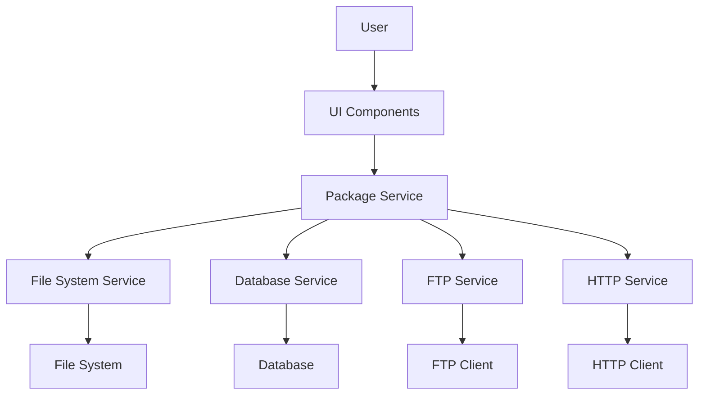

# Design Document: TGZ Package Management

## Overview

The TGZ Package Management feature extends Cherry Studio's packaging capabilities by providing a dedicated interface for managing TGZ packages. This design document outlines the architecture, components, data models, and implementation strategy for integrating TGZ package management into the existing Files section of the application.

The feature will enable users to view, organize, and manage TGZ packages created by the packaging tool, with capabilities for sorting, filtering, viewing detailed metadata, and performing operations such as opening, deleting, and uploading packages to external servers.

## Architecture

The TGZ Package Management feature will be implemented using a layered architecture:

1. **UI Layer**: React components for displaying and interacting with packages
2. **Service Layer**: Business logic for package operations and metadata management
3. **Data Layer**: Storage and retrieval of package information
4. **Integration Layer**: Communication with external systems (file system, FTP, HTTP)

### System Context Diagram



## Components and Interfaces

### UI Components

1. **PackageListView**
   - Displays a list of TGZ packages with basic metadata
   - Provides sorting and filtering options
   - Handles user interactions (select, open, delete, upload)

2. **PackageDetailView**
   - Shows detailed information about a selected package
   - Allows editing of package metadata
   - Displays package contents and structure

3. **PackageFilterBar**
   - Provides UI controls for filtering and sorting packages
   - Includes search functionality

### Service Components

1. **PackageService**
   - Core service for managing package operations
   - Interfaces with the file system and database
   - Handles package metadata extraction and management

   ```typescript
   interface PackageService {
     getPackages(): Promise<Package[]>;
     getPackageById(id: string): Promise<Package | null>;
     updatePackageMetadata(id: string, metadata: PackageMetadata): Promise<boolean>;
     deletePackage(id: string): Promise<boolean>;
     uploadPackageToFTP(id: string, ftpConfig: FTPConfig): Promise<boolean>;
     uploadPackageToHTTP(id: string, httpConfig: HTTPConfig): Promise<boolean>;
   }
   ```

2. **FileSystemService**
   - Handles file system operations for packages
   - Manages package file paths and locations

   ```typescript
   interface FileSystemService {
     openPackageLocation(path: string): Promise<boolean>;
     deletePackageFile(path: string): Promise<boolean>;
     getPackageFileInfo(path: string): Promise<FileInfo>;
   }
   ```

3. **FTPService**
   - Manages FTP uploads for packages
   - Handles FTP connection and authentication

   ```typescript
   interface FTPService {
     uploadFile(filePath: string, ftpConfig: FTPConfig): Promise<boolean>;
   }
   ```

4. **HTTPService**
   - Manages HTTP uploads for packages
   - Handles HTTP requests and authentication

   ```typescript
   interface HTTPService {
     uploadFile(filePath: string, metadata: PackageMetadata, httpConfig: HTTPConfig): Promise<boolean>;
   }
   ```

### Integration with Existing Components

The TGZ Package Management feature will integrate with the following existing components:

1. **Files Section**
   - Add a new "Packages" category to the Files section
   - Reuse existing file listing and navigation components

2. **Packaging Tool**
   - Hook into package creation events to update the package database
   - Access package creation metadata

## Data Models

### Package

The core data model representing a TGZ package:

```typescript
interface Package {
  id: string;           // Unique identifier
  name: string;         // Package name
  path: string;         // File system path
  size: number;         // File size in bytes
  createdAt: Date;      // Creation date
  packageType: PackageType; // Type of package (lingxi-10, lingxi-07a, config, lingxi-06-thrid)
  version: string;      // Package version
  metadata: PackageMetadata; // Additional metadata
}

enum PackageType {
  LINGXI_10 = 'lingxi-10',
  LINGXI_07A = 'lingxi-07a',
  CONFIG = 'config',
  LINGXI_06TRD = 'lingxi-06-thrid'
}

interface PackageMetadata {
  isPatch: boolean;     // Whether it's a patch package
  components: string[]; // Included components
  description: string;  // User-provided description
  tags: string[];       // User-defined tags
  customFields: Record<string, any>; // Additional custom fields
}
```

### FTP Configuration

```typescript
interface FTPConfig {
  host: string;
  port: number;
  username: string;
  password: string;
  remotePath: string;
}
```

### HTTP Configuration

```typescript
interface HTTPConfig {
  url: string;
  method: 'POST' | 'PUT';
  headers: Record<string, string>;
  authentication?: {
    type: 'Basic' | 'Bearer' | 'OAuth';
    token?: string;
    username?: string;
    password?: string;
  };
}
```

## Database Schema

The package information will be stored in a database with the following schema:

```
Table: packages
- id: string (primary key)
- name: string
- path: string
- size: number
- created_at: timestamp
- package_type: string
- version: string
- metadata: json
```

## Error Handling

The system will implement comprehensive error handling for various scenarios:

1. **File System Errors**
   - File not found
   - Permission denied
   - Disk space issues

2. **Network Errors**
   - FTP connection failures
   - HTTP request failures
   - Timeout issues

3. **Data Validation Errors**
   - Invalid package format
   - Metadata parsing errors

Each error will be logged with appropriate context and presented to the user with clear error messages and potential resolution steps.

## Security Considerations

1. **FTP/HTTP Credentials**
   - Credentials will be stored securely using the application's existing credential management system
   - Passwords will not be stored in plain text

2. **File System Access**
   - Operations will be restricted to the application's designated package directories
   - Proper validation of file paths to prevent path traversal attacks

3. **Data Validation**
   - Input validation for all user-provided data
   - Sanitization of file names and paths

## Testing Strategy

### Unit Tests

1. **Service Layer Tests**
   - Test package metadata extraction
   - Test database operations
   - Test file system operations

2. **UI Component Tests**
   - Test rendering of package lists
   - Test filtering and sorting functionality
   - Test user interactions

### Integration Tests

1. **File System Integration**
   - Test package creation and automatic addition to the database
   - Test package deletion from both file system and database

2. **Network Integration**
   - Test FTP uploads with mock FTP server
   - Test HTTP uploads with mock HTTP server

### End-to-End Tests

1. **Complete User Flows**
   - Create package → View in Files → Edit metadata → Upload to server
   - Filter packages → Select package → View details → Delete package

## Implementation Plan

The implementation will be divided into the following phases:

1. **Phase 1: Core Package Management**
   - Implement package database schema
   - Create PackageService and FileSystemService
   - Integrate with existing Files section
   - Implement basic package listing and metadata display

2. **Phase 2: Enhanced Package Operations**
   - Implement package metadata editing
   - Add package deletion functionality
   - Implement sorting and filtering

3. **Phase 3: External Integrations**
   - Implement FTP upload functionality
   - Implement HTTP upload functionality
   - Add progress indicators and error handling

## User Interface Mockups

### Package List View

```
+-----------------------------------------------+
| Files > Packages                       [🔍]   |
+-----------------------------------------------+
| Sort by: Date ▼  | Filter: All ▼             |
+-----------------------------------------------+
| □ lingxi-10-v1.2.3.tgz                       |
|   10.2 MB | 2023-05-15 | lingxi-10           |
+-----------------------------------------------+
| □ config-v2.0.1.tgz                          |
|   2.5 MB  | 2023-05-10 | config              |
+-----------------------------------------------+
| □ lingxi-07a-v3.1.0-patch.tgz                |
|   8.7 MB  | 2023-05-05 | lingxi-07a          |
+-----------------------------------------------+
```

### Package Detail View

```
+-----------------------------------------------+
| Package Details: lingxi-10-v1.2.3.tgz        |
+-----------------------------------------------+
| General Information                           |
| - Name: lingxi-10-v1.2.3.tgz                 |
| - Type: lingxi-10                            |
| - Version: 1.2.3                             |
| - Size: 10.2 MB                              |
| - Created: 2023-05-15 14:30:22               |
+-----------------------------------------------+
| Package Metadata                    [Edit]    |
| - Is Patch: No                               |
| - Components: core, ui, plugins              |
| - Description: [User-editable field]         |
| - Tags: [User-editable tags]                 |
+-----------------------------------------------+
| Actions                                       |
| [Open Location] [Delete] [Upload to Device]  |
| [Upload to Server]                           |
+-----------------------------------------------+
```

## Conclusion

This design document outlines a comprehensive approach to implementing the TGZ Package Management feature in Cherry Studio. The proposed architecture leverages existing components while adding new functionality to enhance the user experience for managing packaged files. The implementation will follow a phased approach, starting with core functionality and progressively adding more advanced features. 