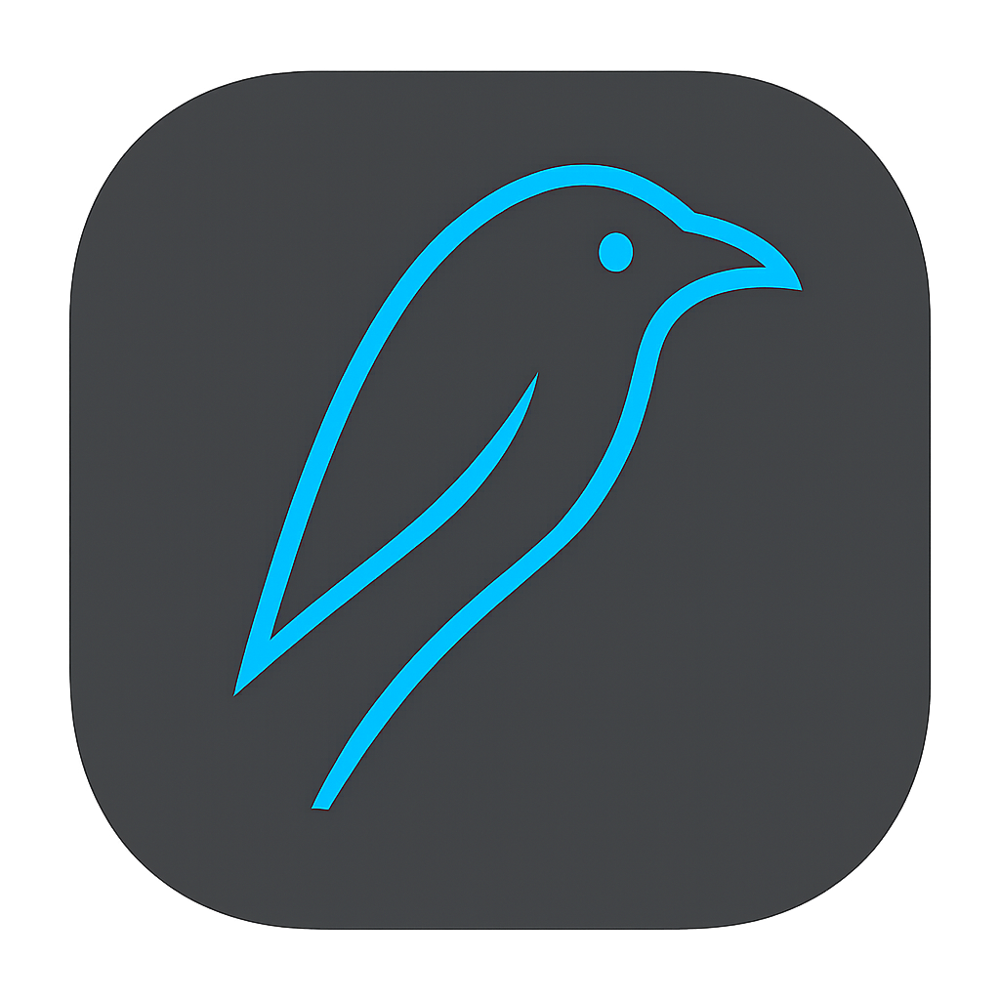

<div align="right" >
  <details>
    <summary >🌐 Language</summary>
    <div>
      <div align="right">
        <p><a href="https://openaitx.github.io/view.html?user=CherryHQ&project=cherry-studio&lang=en">English</a></p>
        <p><a href="https://openaitx.github.io/view.html?user=CherryHQ&project=cherry-studio&lang=zh-CN">简体中文</a></p>
        <p><a href="https://openaitx.github.io/view.html?user=CherryHQ&project=cherry-studio&lang=zh-TW">繁體中文</a></p>
        <p><a href="https://openaitx.github.io/view.html?user=CherryHQ&project=cherry-studio&lang=ja">日本語</a></p>
        <p><a href="https://openaitx.github.io/view.html?user=CherryHQ&project=cherry-studio&lang=ko">한국어</a></p>
        <p><a href="https://openaitx.github.io/view.html?user=CherryHQ&project=cherry-studio&lang=hi">हिन्दी</a></p>
        <p><a href="https://openaitx.github.io/view.html?user=CherryHQ&project=cherry-studio&lang=th">ไทย</a></p>
        <p><a href="https://openaitx.github.io/view.html?user=CherryHQ&project=cherry-studio&lang=fr">Français</a></p>
        <p><a href="https://openaitx.github.io/view.html?user=CherryHQ&project=cherry-studio&lang=de">Deutsch</a></p>
        <p><a href="https://openaitx.github.io/view.html?user=CherryHQ&project=cherry-studio&lang=es">Español</a></p>
        <p><a href="https://openaitx.github.io/view.html?user=CherryHQ&project=cherry-studio&lang=it">Italiano</a></p>
        <p><a href="https://openaitx.github.io/view.html?user=CherryHQ&project=cherry-studio&lang=ru">Русский</a></p>
        <p><a href="https://openaitx.github.io/view.html?user=CherryHQ&project=cherry-studio&lang=pt">Português</a></p>
        <p><a href="https://openaitx.github.io/view.html?user=CherryHQ&project=cherry-studio&lang=nl">Nederlands</a></p>
        <p><a href="https://openaitx.github.io/view.html?user=CherryHQ&project=cherry-studio&lang=pl">Polski</a></p>
        <p><a href="https://openaitx.github.io/view.html?user=CherryHQ&project=cherry-studio&lang=ar">العربية</a></p>
        <p><a href="https://openaitx.github.io/view.html?user=CherryHQ&project=cherry-studio&lang=fa">فارسی</a></p>
        <p><a href="https://openaitx.github.io/view.html?user=CherryHQ&project=cherry-studio&lang=tr">Türkçe</a></p>
        <p><a href="https://openaitx.github.io/view.html?user=CherryHQ&project=cherry-studio&lang=vi">Tiếng Việt</a></p>
        <p><a href="https://openaitx.github.io/view.html?user=CherryHQ&project=cherry-studio&lang=id">Bahasa Indonesia</a></p>
      </div>
    </div>
  </details>
</div>

<h1 align="center">
  <a href="https://github.com/CherryHQ/cherry-studio/releases">
    <br>
  </a>
</h1>

<p align="center">English | <a href="./docs/README.zh.md">中文</a> | <a href="https://cherry-ai.com">Official Site</a> | <a href="https://docs.cherry-ai.com/cherry-studio-wen-dang/en-us">Documents</a> | <a href="./docs/dev.md">Development</a> | <a href="https://github.com/CherryHQ/cherry-studio/issues">Feedback</a><br></p>

# 🚀 Raven - The Intelligent AI Platform

Raven is a comprehensive, multi-modal AI platform built to revolutionize your productivity. Originally conceptualized for the satellite communications domain, Raven has evolved into a fully generalized, cross-platform AI assistant. By integrating advanced natural language processing, extensive knowledge management (RAG), built-in AI terminal (Chaterm), and the Model Context Protocol (MCP), Raven acts as a centralized hub for all your intelligent workflows.

## 🎯 Platform Architecture

Raven consists of two main components:
- **RavenClient**: A powerful desktop application (Windows, macOS, Linux) built on Electron and React. It serves as your daily driver for interacting with AI models, managing knowledge, and running terminal sessions.
- **RavenAIService**: The robust cloud backend service (Python/FastAPI) that powers cloud synchronization, centralized model management, enterprise-grade RAG processing, and shared MCP servers.

## 🌟 Key Features

### 1. 💬 Ultimate AI Chat Experience
- **Multi-Provider Support**: Seamlessly integrate with OpenAI, Anthropic (Claude), Google Gemini, DeepSeek, Ollama, and more.
- **Custom AI Agents**: Create, manage, and interact with specialized AI personas tailored to your workflow.
- **Multi-Modal Capabilities**: Process text, images, office documents, and PDFs in a unified chat interface.

### 2. 📚 Advanced Knowledge Management (RAG)
- **Local & Cloud Vector Search**: Build powerful knowledge bases from your documents.
- **Multiple Parsers**: Intelligent document parsing including OCR support for scanned PDFs and images.
- **Seamless Chat Integration**: Automatically retrieve context from your knowledge bases during conversations.

### 3. 💻 AI-Powered Terminal (Chaterm)
- **Embedded SSH Terminal**: Manage your servers directly within Raven using the integrated Chaterm.
- **Smart Command Assistance**: Ask the AI to generate, explain, or debug terminal commands directly in the terminal interface.
- **Unified LLM Bridge**: Chaterm utilizes Raven's core AI provider configurations, ensuring secure and centralized API key management.

### 4. ⚙️ Model Context Protocol (MCP) Ecosystem
- **Extensible Tooling**: Connect Raven to external systems, databases, and APIs through MCP.
- **Server Registry**: Manage local and remote MCP servers through the centralized registry.

### 5. 🔄 Cloud Sync & Backend Integration
- **RavenAIService Integration**: Synchronize your conversations, prompts, and settings across multiple devices.
- **Centralized Management**: Perfect for teams wanting to manage AI usage, shared knowledge bases, and API configurations centrally.

## 🛠️ Technology Stack

**Client (RavenClient)**
- Electron + React + TypeScript
- Redux Toolkit for State Management
- SQLite / Local Storage

**Server (RavenAIService)**
- Python + FastAPI
- PostgreSQL + pgvector for Embeddings
- Redis + Celery for Async Tasks

## 🚀 Getting Started

### Development Environment

**Prerequisites:**
- Node.js v22.x.x or higher
- Yarn 4.9.1 (Setup: `corepack enable && corepack prepare yarn@4.9.1 --activate`)

**Installation & Execution:**
```bash
yarn install
yarn dev
```

### Build Platforms
- Windows: `yarn build:win`
- macOS: `yarn build:mac`
- Linux: `yarn build:linux`

## 🤝 Contributing
We welcome contributions to make Raven even better! Whether you're interested in improving the UI, adding new MCP servers, or enhancing the backend service, your PRs are always welcome.

## 📄 License
This project is licensed under the GPL-3.0 License.
