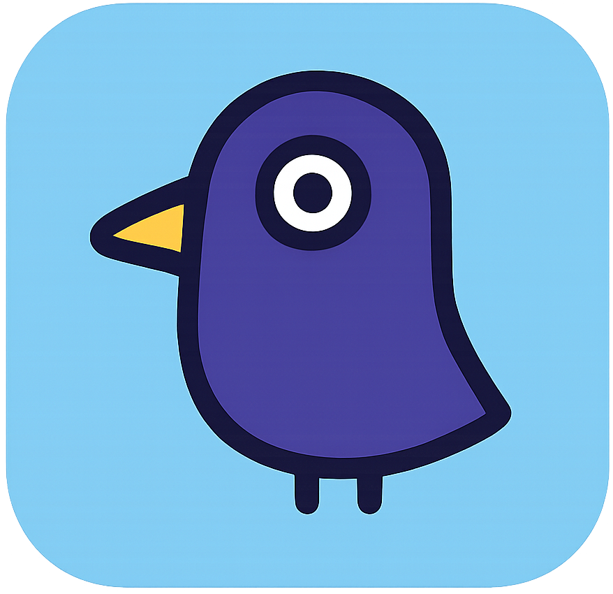

<div align="right" >
  <details>
    <summary >🌐 Language</summary>
    <div>
      <div align="right">
        <p><a href="https://openaitx.github.io/view.html?user=CherryHQ&project=cherry-studio&lang=en">English</a></p>
        <p><a href="https://openaitx.github.io/view.html?user=CherryHQ&project=cherry-studio&lang=zh-CN">简体中文</a></p>
        <p><a href="https://openaitx.github.io/view.html?user=CherryHQ&project=cherry-studio&lang=zh-TW">繁體中文</a></p>
        <p><a href="https://openaitx.github.io/view.html?user=CherryHQ&project=cherry-studio&lang=ja">日本語</a></p>
        <p><a href="https://openaitx.github.io/view.html?user=CherryHQ&project=cherry-studio&lang=ko">한국어</a></p>
        <p><a href="https://openaitx.github.io/view.html?user=CherryHQ&project=cherry-studio&lang=hi">हिन्दी</a></p>
        <p><a href="https://openaitx.github.io/view.html?user=CherryHQ&project=cherry-studio&lang=th">ไทย</a></p>
        <p><a href="https://openaitx.github.io/view.html?user=CherryHQ&project=cherry-studio&lang=fr">Français</a></p>
        <p><a href="https://openaitx.github.io/view.html?user=CherryHQ&project=cherry-studio&lang=de">Deutsch</a></p>
        <p><a href="https://openaitx.github.io/view.html?user=CherryHQ&project=cherry-studio&lang=es">Español</a></p>
        <p><a href="https://openaitx.github.io/view.html?user=CherryHQ&project=cherry-studio&lang=it">Itapano</a></p>
        <p><a href="https://openaitx.github.io/view.html?user=CherryHQ&project=cherry-studio&lang=ru">Русский</a></p>
        <p><a href="https://openaitx.github.io/view.html?user=CherryHQ&project=cherry-studio&lang=pt">Português</a></p>
        <p><a href="https://openaitx.github.io/view.html?user=CherryHQ&project=cherry-studio&lang=nl">Nederlands</a></p>
        <p><a href="https://openaitx.github.io/view.html?user=CherryHQ&project=cherry-studio&lang=pl">Polski</a></p>
        <p><a href="https://openaitx.github.io/view.html?user=CherryHQ&project=cherry-studio&lang=ar">العربية</a></p>
        <p><a href="https://openaitx.github.io/view.html?user=CherryHQ&project=cherry-studio&lang=fa">فارسی</a></p>
        <p><a href="https://openaitx.github.io/view.html?user=CherryHQ&project=cherry-studio&lang=tr">Türkçe</a></p>
        <p><a href="https://openaitx.github.io/view.html?user=CherryHQ&project=cherry-studio&lang=vi">Tiếng Việt</a></p>
        <p><a href="https://openaitx.github.io/view.html?user=CherryHQ&project=cherry-studio&lang=id">Bahasa Indonesia</a></p>
      </div>
    </div>
  </details>
</div>

<h1 align="center">
  <a href="https://github.com/CherryHQ/cherry-studio/releases">
    <br>
  </a>
</h1>

<p align="center">English | <a href="./docs/README.zh.md">中文</a> | <a href="https://cherry-ai.com">Official Site</a> | <a href="https://docs.cherry-ai.com/cherry-studio-wen-dang/en-us">Documents</a> | <a href="./docs/dev.md">Development</a> | <a href="https://github.com/CherryHQ/cherry-studio/issues">Feedback</a><br></p>


# 🚀 Raven - Satellite Baseband Payload Testing Platform

Raven is an AI-powered satellite baseband payload testing and development platform, built on top of Cherry Studio. It revolutionizes satellite testing workflows by integrating natural language processing, automated testing, and intelligent payload control systems.


# 🎯 Project Objectives

## Core Goals

- **Enhance Testing Efficiency**: Improve satellite baseband payload testing and development workflows, reducing manual Linux system operations and optimizing testing processes.
- **Reduce Communication Costs**: Minimize communication and operational complexity between development and testing teams, enabling more efficient testing and validation processes.

## Specific Targets

- **Improve Development Efficiency**: Achieve 5%+ efficiency improvement through automation tools and AI assistance, reducing manual intervention.
- **Reduce Management Costs**: Simplify patch management, task scheduling, and test execution, reducing traditional manual operations and management resource waste by 10%+.
- **Enhance Collaboration**: Integrate natural language understanding and Python code execution, allowing testers to focus more time on designing and orchestrating test cases while AI executes them through Python scripts, improving test accuracy and reducing execution time.

# 🌟 Key Features

## 1. **Satellite Payload Management**

- 🛰️ **Internal Tools**: Python-based secondary encapsulation of common OAM interfaces (e.g., satellite software interfaces) for baseband payloads, supporting operator simulation of network management operations.
- 📦 **Patch Management System**: Convenient packaging tools for developers to upload patches with automatic server backup, ensuring testers always have access to the latest code versions.
- 🔄 **Automated Upload**: Streamlined patch upload and version management, improving efficiency by 50%.

## 2. **AI-Powered Natural Language Control**

- 🗣️ **Natural Language Operations**: Direct payload status queries and control operations through natural language instructions via MCP Server interfaces.
- 🤖 **Large Language Model Integration**: Support for major LLMs including Alibaba Qwen, DeepSeek, Gemini, and more.
- 📚 **RAG Knowledge Base**: Enhanced understanding of satellite baseband payload private domain knowledge, reducing instruction parsing errors and system operation errors.

## 3. **Automated Testing & Code Execution**

- 🐍 **Python Sandbox Environment**: Secure execution environment for automated test cases with real-time feedback.
- 🔧 **MCP Server Integration**: Comprehensive integration of payload internal tools and Python code execution sandbox environment.
- ⚡ **Automated Test Execution**: 60% reduction in manual operation time through automated testing and natural language operations.

## 4. **Enhanced Client Experience**

- 💬 **AI ChatBot Client**: Based on open-source Cherry Studio, featuring simplified operations and MCP Client support for large model operations on base station external tool sets.
- 📋 **Pre-configured Templates**: Pre-installed "Baseband Payload Testing Assistant" Prompt templates for immediate use.
- 🎯 **Streamlined Workflow**: Optimized interface for efficient patch management and real-time test content updates.

## 5. **Cross-Platform Support**

- 🖥️ **Multi-Platform**: Available on Windows, Mac, and Linux
- 📦 **Ready to Use**: No environment setup required
- 🎨 **Modern UI**: Light/Dark themes and transparent windows
- 🔌 **Plugin System**: Extensible architecture for custom integrations

# 📊 Performance Metrics

## Efficiency Improvements

- **Testing Cycle**: 60% reduction in manual operation time through automated testing and natural language operations
- **Patch Management**: 50% efficiency improvement in patch upload and version management
- **Management Costs**: 20% reduction in management and testing-related time costs
- **Resource Utilization**: Increased test execution capacity within the same timeframe

## Value Proposition

- **Development Efficiency**: 5%+ improvement through automation and AI assistance
- **Management Cost Reduction**: 10%+ reduction in traditional manual operations
- **Test Accuracy**: Enhanced through AI-powered execution and RAG knowledge integration
- **Communication Optimization**: Streamlined workflows between development and testing teams

# 🔧 Technical Architecture

## Core Components

1. **Satellite Baseband Payload Internal Tools**: Python-based interface encapsulation for OAM operations
2. **Satellite Baseband Payload MCP Server**: Integrated payload tools with Python execution sandbox
3. **Large Model Client**: Cherry Studio-based AI ChatBot with MCP Client support
4. **Patch Management System**: Automated patch upload and version control
5. **RAG Knowledge Base**: Enhanced domain-specific understanding for satellite operations

## Technology Stack

- **Natural Language Processing**: Integration with Qwen, DeepSeek, Gemini, and other major LLMs
- **Python Sandbox**: Secure execution environment for test automation
- **MCP Protocol**: Model Context Protocol for seamless AI integration
- **RAG Technology**: Retrieval-Augmented Generation for enhanced knowledge understanding

# 🚀 Getting Started

## Prerequisites

- Python 3.8+
- Node.js 16+
- Git

## Installation

```bash
# Clone the repository
git clone https://github.com/visiontrail/Raven.git
cd Raven

# Install dependencies
npm install

# Start development server
npm run dev
```

## Configuration

1. **Configure MCP Server**: Set up satellite payload MCP server endpoints
2. **Setup RAG Knowledge Base**: Configure domain-specific knowledge for satellite operations
3. **Configure LLM Providers**: Add your preferred language model API keys
4. **Setup Patch Management**: Configure patch upload and storage locations

# 📝 Roadmap

## Phase 1: Core Infrastructure ✅
- [x] Satellite payload internal tools development
- [x] MCP Server integration
- [x] Basic natural language control
- [x] Patch management system

## Phase 2: AI Enhancement 🚧
- [ ] Advanced RAG knowledge base optimization
- [ ] Multi-model LLM support expansion
- [ ] Enhanced natural language understanding
- [ ] Automated test case generation

## Phase 3: Advanced Features 📋
- [ ] Real-time payload monitoring
- [ ] Advanced analytics and reporting
- [ ] Multi-satellite support
- [ ] Integration with satellite ground stations

## Phase 4: Enterprise Features 🔮
- [ ] Team collaboration features
- [ ] Advanced access control
- [ ] Enterprise-grade security
- [ ] Custom deployment options

# 🤝 Contributing

We welcome contributions to Raven! Here are some ways you can contribute:

1. **Satellite Domain Expertise**: Share knowledge about satellite operations and testing
2. **AI/ML Development**: Improve natural language processing and automation
3. **Testing Framework**: Enhance automated testing capabilities
4. **Documentation**: Improve user guides and technical documentation
5. **Bug Reports**: Help identify and fix issues
6. **Feature Requests**: Suggest new capabilities and improvements

## Getting Started

1. **Fork the Repository**: Fork and clone it to your local machine
2. **Create a Branch**: Create a feature branch for your changes
3. **Submit Changes**: Commit and push your changes
4. **Open a Pull Request**: Describe your changes and their impact

For detailed guidelines, please refer to our [Contributing Guide](CONTRIBUTING.md).

# 🔗 Related Projects

- [Cherry Studio](https://github.com/CherryHQ/cherry-studio): The base AI desktop client that Raven is built upon
- [MCP Protocol](https://modelcontextprotocol.io/): Model Context Protocol for AI tool integration


# 📄 License

This project is licensed under the AGPL-3.0 License - see the [LICENSE](LICENSE) file for details.

For commercial licensing inquiries, please contact: **📧 [license@cherry-ai.com](mailto:license@cherry-ai.com)**

---

**Raven** - Revolutionizing satellite testing through AI-powered automation and natural language control.

<!-- Links & Images -->

[deepwiki-shield]: https://img.shields.io/badge/Deepwiki-CherryHQ-0088CC?logo=data:image/svg+xml;base64,PHN2ZyB4bWxucz0iaHR0cDovL3d3dy53My5vcmcvMjAwMC9zdmciIHZpZXdCb3g9IjAgMCAyNy45MyAzMiI+PHBhdGggZD0iTTE5LjMzIDE0LjEyYy42Ny0uMzkgMS41LS4zOSAyLjE4IDBsMS43NCAxYy4wNi4wMy4xMS4wNi4xOC4wN2guMDRjLjA2LjAzLjEyLjAzLjE4LjAzaC4wMmMuMDYgMCAuMTEgMCAuMTctLjAyaC4wM2MuMDYtLjAyLjEyLS4wNS4xNy0uMDhoLjAybDMuNDgtMi4wMWMuMjUtLjE0LjQtLjQxLjQtLjdWOC40YS44MS44MSAwIDAgMC0uNC0uN2wtMy40OC0yLjAxYS44My44MyAwIDAgMC0uODEgMEwxOS43NyA3LjdoLS4wMWwtLjE1LjEyLS4wMi4wMnMtLjA3LjA5LS4xLjE0VjhhLjQuNCAwIDAgMC0uMDguMTd2LjA0Yy0uMDMuMDYtLjAzLjEyLS4wMy4xOXYyLjAxYzAgLjc4LS40MSAxLjQ5LTEuMDkgMS44OC0uNjcuMzktMS41LjM5LTIuMTggMGwtMS43NC0xYS42LjYgMCAwIDAtLjIxLS4wOGMtLjA2LS4wMS0uMTItLjAyLS4xOC0uMDJoLS4wM2MtLjA2IDAtLjExLjAxLS4xNy4wMmgtLjAzYy0uMDYuMDItLjEyLjA0LS4xNy4wN2gtLjAybC0zLjQ3IDIuMDFjLS4yNS4xNC0uNC40MS0uNC43VjE4YzAgLjI5LjE1LjU1LjQuN2wzLjQ4IDIuMDFoLjAyYy4wNi4wNC4xMS4wNi4xNy4wOGguMDNjLjA1LjAyLjExLjAzLjE3LjAzaC4wMmMuMDYgMCAuMTIgMCAuMTgtLjAyaC4wNGMuMDYtLjAzLjEyLS4wNS4xOC0uMDhsMS43NC0xYy42Ny0uMzkgMS41LS4zOSAyLjE3IDBzMS4wOSAxLjExIDEuMDkgMS44OHYyLjAxYzAgLjA3IDAgLjEzLjAyLjE5di4wNGMuMDMuMDYuMDUuMTIuMDguMTd2LjAycy4wOC4wOS4xMi4xM2wuMDIuMDJzLjA5LjA4LjE1LjExYzAgMCAuMDEgMCAuMDEuMDFsMy40OCAyLjAxYy4yNS4xNC41Ni4xNC44MSAwbDMuNDgtMi4wMWMuMjUtLjE0LjQtLjQxLjQtLjd2LTQuMDFhLjgxLjgxIDAgMCAwLS40LS43bC0zLjQ4LTIuMDFoLS4wMmMtLjA1LS4wNC0uMTEtLjA2LS4xNy0uMDhoLS4wM2EuNS41IDAgMCAwLS4xNy0uMDNoLS4wM2MtLjA2IDAtLjEyIDAtLjE4LjAyLS4wNy4wMi0uMTUuMDUtLjIxLjA4bC0xLjc0IDFjLS42Ny4zOS0xLjUuMzktMi4xNyAwYTIuMTkgMi4xOSAwIDAgMS0xLjA5LTEuODhjMC0uNzguNDItMS40OSAxLjA5LTEuODhaIiBzdHlsZT0iZmlsbDojNWRiZjlkIi8+PHBhdGggZD0ibS40IDEzLjExIDMuNDcgMi4wMWMuMjUuMTQuNTYuMTQuOCAwbDMuNDctMi4wMWguMDFsLjE1LS4xMi4wMi0uMDJzLjA3LS4wOS4xLS4xNGwuMDItLjAyYy4wMy0uMDUuMDUtLjExLjA3LS4xN3YtLjA0Yy4wMy0uMDYuMDMtLjEyLjAzLS4xOVYxMC40YzAtLjc4LjQyLTEuNDkgMS4wOS0xLjg4czEuNS0uMzkgMi4xOCAwbDEuNzQgMWMuMDcuMDQuMTQuMDcuMjEuMDguMDYuMDEuMTIuMDIuMTguMDJoLjAzYy4wNiAwIC4xMS0uMDEuMTctLjAyaC4wM2MuMDYtLjAyLjEyLS4wNC4xNy0uMDdoLjAybDMuNDctMi4wMmMuMjUtLjE0LjQtLjQxLjQtLjd2LTRhLjgxLjgxIDAgMCAwLS40LS43bC0zLjQ2LTJhLjgzLjgzIDAgMCAwLS44MSAwbC0zLjQ4IDIuMDFoLS4wMWwtLjE1LjEyLS4wMi4wMi0uMS4xMy0uMDIuMDJjLS4wMy4wNS0uMDUuMTEtLjA3LjE3di4wNGMtLjAzLjA2LS4wMy4xMi0uMDMuMTl2Mi4wMWMwIC43OC0uNDIgMS40OS0xLjA5IDEuODhzLTEuNS4zOS0yLjE4IDBsLTEuNzQtMWEuNi42IDAgMCAwLS4yMS0uMDhjLS4wNi0uMDEtLjEyLS4wMi0uMTgtLjAyaC0uMDNjLS4wNiAwLS4xMS4wMS0uMTcuMDJoLS4wM2MtLjA2LjAyLS4xMi4wNS0uMTcuMDhoLS4wMkwuNCA3LjcxYy0uMjUuMTQtLjQuNDEtLjQuNjl2NC4wMWMwIC4yOS4xNS41Ni40LjciIHN0eWxlPSJmaWxsOiM0NDY4YzQiLz48cGF0aCBkPSJtMTcuODQgMjQuNDgtMy40OC0yLjAxaC0uMDJjLS4wNS0uMDQtLjExLS4wNi0uMTctLjA4aC0uMDNhLjUuNSAwIDAgMC0uMTctLjAzaC0uMDNjLS4wNiAwLS4xMiAwLS4xOC4wMmgtLjA0Yy0uMDYuMDMtLjEyLjA1LS4xOC4wOGwtMS43NCAxYy0uNjcuMzktMS41LjM5LTIuMTggMGEyLjE5IDIuMTkgMCAwIDEtMS4wOS0xLjg4di0yLjAxYzAtLjA2IDAtLjEzLS4wMi0uMTl2LS4wNGMtLjAzLS4wNi0uMDUtLjExLS4wOC0uMTdsLS4wMi0uMDJzLS4wNi0uMDktLjEtLjEzTDguMjkgMTlzLS4wOS0uMDgtLjE1LS4xMWgtLjAxbC0zLjQ3LTIuMDJhLjgzLjgzIDAgMCAwLS44MSAwTC4zNyAxOC44OGEuODcuODcgMCAwIDAtLjM3LjcxdjQuMDFjMCAuMjkuMTUuNTUuNC43bDMuNDcgMi4wMWguMDJjLjA1LjA0LjExLjA2LjE3LjA4aC4wM2MuMDUuMDIuMTEuMDMuMTYuMDNoLjAzYy4wNiAwIC4xMiAwIC4xOC0uMDJoLjA0Yy4wNi0uMDMuMTItLjA1LjE4LS4wOGwxLjc0LTFjLjY3LS4zOSAxLjUtLjM5IDIuMTcgMHMxLjA5IDEuMTEgMS4wOSAxLjg4djIuMDFjMCAuMDcgMCAuMTMuMDIuMTl2LjA0Yy4wMy4wNi4wNS4xMS4wOC4xN2wuMDIuMDJzLjA2LjA5LjEuMTRsLjAyLjAycy4wOS4wOC4xNS4xMWguMDFsMy40OCAyLjAyYy4yNS4xNC41Ni4xNC44MSAwbDMuNDgtMi4wMWMuMjUtLjE0LjQtLjQxLjQtLjdWMjUuMmEuODEuODEgMCAwIDAtLjQtLjdaIiBzdHlsZT0iZmlsbDojNDI5M2Q5Ii8+PC9zdmc+
[deepwiki-link]: https://deepwiki.com/CherryHQ/cherry-studio
[twitter-shield]: https://img.shields.io/badge/Twitter-CherryStudioApp-0088CC?logo=x
[twitter-link]: https://twitter.com/CherryStudioHQ
[discord-shield]: https://img.shields.io/badge/Discord-@CherryStudio-0088CC?logo=discord
[discord-link]: https://discord.gg/wez8HtpxqQ
[telegram-shield]: https://img.shields.io/badge/Telegram-@CherryStudioAI-0088CC?logo=telegram
[telegram-link]: https://t.me/CherryStudioAI

<!-- Links & Images -->

[github-release-shield]: https://img.shields.io/github/v/release/CherryHQ/cherry-studio?logo=github
[github-release-link]: https://github.com/CherryHQ/cherry-studio/releases
[github-nightly-shield]: https://img.shields.io/github/actions/workflow/status/CherryHQ/cherry-studio/nightly-build.yml?label=nightly%20build&logo=github
[github-nightly-link]: https://github.com/CherryHQ/cherry-studio/actions/workflows/nightly-build.yml
[github-contributors-shield]: https://img.shields.io/github/contributors/CherryHQ/cherry-studio?logo=github
[github-contributors-link]: https://github.com/CherryHQ/cherry-studio/graphs/contributors

<!-- Links & Images -->

[license-shield]: https://img.shields.io/badge/License-AGPLv3-important.svg?logo=gnu
[license-link]: https://www.gnu.org/licenses/agpl-3.0
[commercial-shield]: https://img.shields.io/badge/License-Contact-white.svg?logoColor=white&logo=telegram&color=blue
[commercial-link]: mailto:license@cherry-ai.com?subject=Commercial%20License%20Inquiry
[sponsor-shield]: https://img.shields.io/badge/Sponsor-FF6699.svg?logo=githubsponsors&logoColor=white
[sponsor-link]: https://github.com/CherryHQ/cherry-studio/blob/main/docs/sponsor.md
