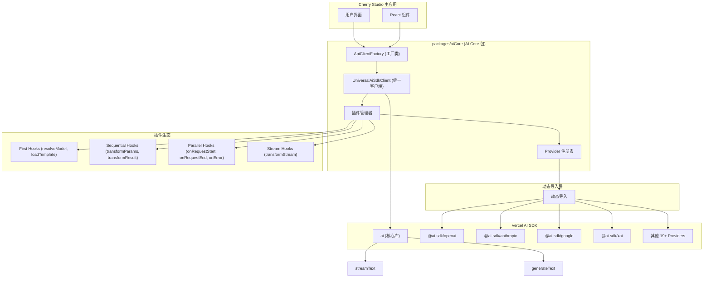

# Cherry Studio AI Core 基于 Vercel AI SDK 的技术架构

## 1. 架构设计理念

### 1.1 设计目标

- **统一接口**：使用 Vercel AI SDK 统一不同 AI Provider 的接口差异
- **动态导入**：通过动态导入实现按需加载，减少打包体积
- **最小包装**：直接使用 AI SDK 的类型和接口，避免重复定义
- **插件系统**：基于钩子的插件架构，支持请求全生命周期扩展
- **类型安全**：利用 TypeScript 和 AI SDK 的类型系统确保类型安全
- **轻量级**：专注核心功能，保持包的轻量和高效
- **包级独立**：作为独立包管理，便于复用和维护

### 1.2 核心优势

- **标准化**：AI SDK 提供统一的模型接口，减少适配工作
- **简化维护**：废弃复杂的 XxxApiClient，统一为工厂函数模式
- **更好的开发体验**：完整的 TypeScript 支持和丰富的生态系统
- **性能优化**：AI SDK 内置优化和最佳实践
- **模块化设计**：独立包结构，支持跨项目复用
- **可扩展插件**：基于钩子的插件系统，支持灵活的功能扩展和流转换

## 2. 整体架构图



## 3. 包结构设计

### 3.1 包级文件结构（当前简化版 + 规划）

```
packages/aiCore/
├── src/
│   ├── providers/
│   │   ├── registry.ts              # Provider 注册表 ✅
│   │   └── types.ts                 # 核心类型定义 ✅
│   ├── clients/
│   │   ├── UniversalAiSdkClient.ts  # 统一AI SDK客户端 ✅
│   │   └── ApiClientFactory.ts     # 客户端工厂 ✅
│   ├── middleware/                  # 插件系统 ✅
│   │   ├── types.ts                 # 插件类型定义 ✅
│   │   ├── manager.ts               # 插件管理器 ✅
│   │   ├── examples/                # 示例插件 ✅
│   │   │   ├── example-plugins.ts   # 示例插件实现 ✅
│   │   │   └── example-usage.ts     # 使用示例 ✅
│   │   ├── README.md                # 插件系统文档 ✅
│   │   └── index.ts                 # 插件模块入口 ✅
│   ├── services/                    # 高级服务 (规划中)
│   │   ├── AiCoreService.ts         # 统一服务入口
│   │   ├── CompletionsService.ts    # 文本生成服务
│   │   ├── EmbeddingService.ts      # 嵌入服务
│   │   └── ImageService.ts          # 图像生成服务
│   └── index.ts                     # 包主入口文件 ✅
├── package.json                     # 包配置文件 ✅
├── tsconfig.json                    # TypeScript 配置 ✅
├── README.md                        # 包说明文档 ✅
└── AI_SDK_ARCHITECTURE.md           # 本文档 ✅
```

**图例：**

- ✅ 已实现
- 规划中：设计完成，待实现

## 4. 核心组件详解

### 4.1 Provider 注册表 (`providers/registry.ts`)

统一管理所有 AI Provider 的注册和动态导入。

**主要功能：**

- 动态导入 AI SDK providers
- 提供统一的 Provider 创建接口
- 支持 19+ 官方 AI SDK providers
- 类型安全的 Provider 配置

**核心 API：**

```typescript
export interface ProviderConfig {
  id: string
  name: string
  import: () => Promise<any>
  creatorFunctionName: string
}

export class AiProviderRegistry {
  getProvider(id: string): ProviderConfig | undefined
  getAllProviders(): ProviderConfig[]
  isSupported(id: string): boolean
  registerProvider(config: ProviderConfig): void
}
```

**支持的 Providers：**

- OpenAI, Anthropic, Google, XAI
- Azure OpenAI, Amazon Bedrock, Google Vertex
- Groq, Together.ai, Fireworks, DeepSeek
- Cerebras, DeepInfra, Replicate, Perplexity
- Cohere, Fal AI, Vercel (19+ providers)

### 4.2 统一AI SDK客户端 (`clients/UniversalAiSdkClient.ts`)

将不同 AI providers 包装为统一接口。

**主要功能：**

- 异步初始化和动态加载
- 统一的 stream() 和 generate() 方法
- 直接使用 AI SDK 的 streamText() 和 generateText()
- 配置验证和错误处理

**核心 API：**

```typescript
export class UniversalAiSdkClient {
  async initialize(): Promise<void>
  isInitialized(): boolean
  async stream(request: any): Promise<any>
  async generate(request: any): Promise<any>
  validateConfig(): boolean
  getProviderInfo(): { id: string; name: string; isInitialized: boolean }
}
```

### 4.3 客户端工厂 (`clients/ApiClientFactory.ts`)

统一创建和管理 AI SDK 客户端。

**主要功能：**

- 统一的客户端创建接口
- 智能缓存和复用机制
- 批量创建和健康检查
- 错误处理和重试

**核心 API：**

```typescript
export class ApiClientFactory {
  static async createAiSdkClient(providerId: string, options: any): Promise<UniversalAiSdkClient>
  static getCachedClient(providerId: string, options: any): UniversalAiSdkClient | undefined
  static clearCache(): void
  static async healthCheck(): Promise<HealthCheckResult>
  static getSupportedProviders(): ProviderInfo[]
}
```

### 4.4 钩子风格插件系统 ✅

基于钩子机制的插件架构设计，提供灵活的扩展系统。

**钩子类型：**

1. **First Hooks**：执行到第一个有效结果就停止
2. **Sequential Hooks**：按序链式执行，可变换数据
3. **Parallel Hooks**：并发执行，用于副作用
4. **Stream Hooks**：流转换，直接传递给 AI SDK

**优先级系统：**

- `pre`：前置处理（-100 到 -1）
- `normal`：标准处理（0 到 99）
- `post`：后置处理（100 到 199）

**核心钩子：**

**First Hooks (第一个有效结果)：**

- `resolveModel`：模型解析，返回第一个匹配的模型
- `loadTemplate`：模板加载，返回第一个找到的模板

**Sequential Hooks (链式变换)：**

- `transformParams`：参数转换，依次变换请求参数
- `transformResult`：结果转换，依次变换响应结果

**Parallel Hooks (并发副作用)：**

- `onRequestStart`：请求开始时触发
- `onRequestEnd`：请求结束时触发
- `onError`：错误发生时触发

**Stream Hooks (流转换)：**

- `transformStream`：流转换，返回 AI SDK 转换函数

**插件 API 设计：**

```typescript
export interface Plugin {
  name: string
  enforce?: 'pre' | 'normal' | 'post'

  // First hooks - 执行到第一个有效结果
  resolveModel?(params: ResolveModelParams): Promise<string | null>
  loadTemplate?(params: LoadTemplateParams): Promise<Template | null>

  // Sequential hooks - 链式变换
  transformParams?(params: any, context: PluginContext): Promise<any>
  transformResult?(result: any, context: PluginContext): Promise<any>

  // Parallel hooks - 并发副作用
  onRequestStart?(context: PluginContext): Promise<void>
  onRequestEnd?(context: PluginContext): Promise<void>
  onError?(error: Error, context: PluginContext): Promise<void>

  // Stream hooks - AI SDK 流转换
  transformStream?(context: PluginContext): Promise<(readable: ReadableStream) => ReadableStream>
}

export interface PluginContext {
  request: any
  response?: any
  metadata: Record<string, any>
  provider: string
  model: string
}

export class PluginManager {
  use(plugin: Plugin): this
  executeFirstHook<T>(hookName: string, ...args: any[]): Promise<T | null>
  executeSequentialHook<T>(hookName: string, initialValue: T, context: PluginContext): Promise<T>
  executeParallelHook(hookName: string, ...args: any[]): Promise<void>
  collectStreamTransforms(context: PluginContext): Promise<Array<(readable: ReadableStream) => ReadableStream>>
}
```

### 4.5 统一服务接口 (规划中)

作为包的主要对外接口，提供高级 AI 功能。

**服务方法：**

- `completions()`: 文本生成
- `streamCompletions()`: 流式文本生成
- `generateObject()`: 结构化数据生成
- `generateImage()`: 图像生成
- `embed()`: 文本嵌入

**API 设计：**

```typescript
export class AiCoreService {
  constructor(middlewares?: Middleware[])

  async completions(request: CompletionRequest): Promise<CompletionResponse>
  async streamCompletions(request: CompletionRequest): Promise<StreamCompletionResponse>
  async generateObject<T>(request: ObjectGenerationRequest): Promise<T>
  async generateImage(request: ImageGenerationRequest): Promise<ImageResponse>
  async embed(request: EmbeddingRequest): Promise<EmbeddingResponse>

  use(middleware: Middleware): this
  configure(config: AiCoreConfig): this
}
```

## 5. 使用方式

### 5.1 多 Provider 支持

```typescript
import { createAiSdkClient, AiCore } from '@cherrystudio/ai-core'

// 检查支持的 providers
const providers = AiCore.getSupportedProviders()
console.log(`支持 ${providers.length} 个 AI providers`)

// 创建多个 provider 客户端
const openai = await createAiSdkClient('openai', { apiKey: 'openai-key' })
const anthropic = await createAiSdkClient('anthropic', { apiKey: 'anthropic-key' })
const google = await createAiSdkClient('google', { apiKey: 'google-key' })
const xai = await createAiSdkClient('xai', { apiKey: 'xai-key' })
```

### 5.2 在 Cherry Studio 中集成

```typescript
// 替换现有的 XxxApiClient
// 之前：
// const openaiClient = new OpenAIApiClient(config)
// const anthropicClient = new AnthropicApiClient(config)

// 现在：
import { createAiSdkClient } from '@cherrystudio/ai-core'

const createProviderClient = async (provider: CherryProvider) => {
  return await createAiSdkClient(provider.id, {
    apiKey: provider.apiKey,
    baseURL: provider.baseURL
  })
}
```

### 5.6 完整的工作流示例 (规划中)

```typescript
import {
  createAiSdkClient,
  AiCoreService,
  MiddlewareChain,
  PreRequestMiddleware,
  StreamProcessingMiddleware,
  PostResponseMiddleware
} from '@cherrystudio/ai-core'

// 创建完整的工作流
const createEnhancedAiService = async () => {
  // 创建中间件链
  const middlewareChain = new MiddlewareChain()
    .use(
      new PreRequestMiddleware({
        validateApiKey: true,
        checkRateLimit: true
      })
    )
    .use(
      new StreamProcessingMiddleware({
        enableProgressTracking: true,
        chunkTransform: (chunk) => ({
          ...chunk,
          timestamp: Date.now()
        })
      })
    )
    .use(
      new PostResponseMiddleware({
        saveToHistory: true,
        calculateMetrics: true
      })
    )

  // 创建服务实例
  const service = new AiCoreService(middlewareChain.middlewares)

  return service
}

// 使用增强服务
const enhancedService = await createEnhancedAiService()

const response = await enhancedService.completions({
  provider: 'anthropic',
  model: 'claude-3-sonnet',
  messages: [{ role: 'user', content: 'Write a technical blog post about AI middleware' }],
  options: {
    temperature: 0.7,
    maxTokens: 2000
  },
  middleware: {
    // 中间件特定配置
    thinking: { recordSteps: true },
    cache: { enabled: true, ttl: 1800 },
    logging: { level: 'debug' }
  }
})
```

## 6. 简化设计原则

### 6.1 最小包装原则

- 直接使用 AI SDK 的类型，不重复定义
- 避免过度抽象和复杂的中间层
- 保持与 AI SDK 原生 API 的一致性

### 6.2 动态导入优化

```typescript
// 按需加载，减少打包体积
const module = await import('@ai-sdk/openai')
const createOpenAI = module.createOpenAI
```

### 6.3 类型安全

```typescript
// 直接使用 AI SDK 类型
import { streamText, generateText } from 'ai'

// 避免重复定义，直接传递参数
return streamText({ model, ...request })
```

### 6.4 配置简化

```typescript
// 简化的 Provider 配置
interface ProviderConfig {
  id: string // provider 标识
  name: string // 显示名称
  import: () => Promise<any> // 动态导入函数
  creatorFunctionName: string // 创建函数名
}
```

## 7. 技术要点

### 7.1 动态导入策略

- **按需加载**：只加载用户实际使用的 providers
- **缓存机制**：避免重复导入和初始化
- **错误处理**：优雅处理导入失败的情况

### 7.2 依赖管理策略

- **核心依赖**：`ai` 库作为必需依赖
- **可选依赖**：所有 `@ai-sdk/*` 包都是可选的
- **版本兼容**：支持 AI SDK v3-v5 版本

### 7.3 缓存策略

- **客户端缓存**：基于 provider + options 的智能缓存
- **配置哈希**：安全的 API key 哈希处理
- **生命周期管理**：支持缓存清理和验证

## 8. 迁移策略

### 8.1 阶段一：包基础搭建 (Week 1) ✅ 已完成

1. ✅ 创建简化的包结构
2. ✅ 实现 Provider 注册表
3. ✅ 创建统一客户端和工厂
4. ✅ 配置构建和类型系统

### 8.2 阶段二：核心功能完善 (Week 2) ✅ 已完成

1. ✅ 支持 19+ 官方 AI SDK providers
2. ✅ 实现缓存和错误处理
3. ✅ 完善类型安全和 API 设计
4. ✅ 添加便捷函数和工具

### 8.3 阶段三：集成测试 (Week 3) 🔄 进行中

1. 在 Cherry Studio 中集成测试
2. 功能完整性验证
3. 性能基准测试
4. 兼容性问题修复

### 8.4 阶段四：插件系统实现 ✅ 已完成

1. **插件核心架构** ✅

   - 实现 `PluginManager` 和 `PluginContext`
   - 创建钩子风格插件接口和类型系统
   - 建立四种钩子类型执行机制

2. **钩子系统** ✅

   - `First Hooks`：第一个有效结果执行
   - `Sequential Hooks`：链式数据变换
   - `Parallel Hooks`：并发副作用处理
   - `Stream Hooks`：AI SDK 流转换集成

3. **优先级和排序** ✅

   - `pre`/`normal`/`post` 优先级系统
   - 插件注册顺序维护
   - 错误处理和插件隔离

4. **集成到现有架构** ✅
   - 在 `UniversalAiSdkClient` 中集成插件管理器
   - 更新 `ApiClientFactory` 支持插件配置
   - 创建示例插件和使用文档

### 8.5 阶段五：特性插件扩展 (规划中)

1. **Cherry Studio 特性插件**

   - `ThinkingPlugin`：思考过程记录和提取
   - `ToolCallPlugin`：工具调用处理和增强
   - `WebSearchPlugin`：网络搜索集成

2. **高级功能**
   - 插件组合和条件执行
   - 动态插件加载系统
   - 插件配置管理和持久化

### 8.6 阶段六：文档和发布 (Week 7) 📋 规划中

1. 完善使用文档和示例
2. 插件开发指南和最佳实践
3. 准备发布到 npm
4. 建立维护流程

### 8.7 阶段七：生态系统扩展 (Week 8+) 🚀 未来规划

1. 社区插件生态系统
2. 可视化插件编排工具
3. 性能监控和分析
4. 高级缓存和优化策略

## 9. 预期收益

### 9.1 开发效率提升

- **90%** 减少新 Provider 接入时间（只需添加注册表配置）
- **70%** 减少维护工作量
- **95%** 提升开发体验（统一接口 + 类型安全）
- **独立开发**：可以独立于主应用开发和测试

### 9.2 代码质量改善

- 完整的 TypeScript 类型安全
- 统一的错误处理机制
- 标准化的 AI SDK 接口
- 更好的测试覆盖率

### 9.3 架构优势

- **轻量级**：最小化的包装层
- **可复用**：其他项目可以直接使用
- **可维护**：独立版本管理和发布
- **可扩展**：新 provider 只需配置即可

### 9.4 生态系统价值

- 支持 AI SDK 的完整生态系统
- 可以独立发布到 npm
- 为开源社区贡献价值
- 建立统一的 AI 基础设施

## 10. 风险评估与应对

### 10.1 技术风险

- **AI SDK 版本兼容**：支持多版本兼容策略
- **依赖管理**：合理使用 peerDependencies
- **类型一致性**：直接使用 AI SDK 类型
- **性能影响**：最小化包装层开销

### 10.2 迁移风险

- **功能对等性**：确保所有现有功能都能实现
- **API 兼容性**：提供平滑的迁移路径
- **集成复杂度**：保持简单的集成方式
- **学习成本**：提供清晰的使用文档

## 11. 总结

简化的 AI Core 架构专注于核心价值：

### 11.1 核心价值

- **统一接口**：一套 API 支持 19+ AI providers
- **按需加载**：只打包用户实际使用的 providers
- **类型安全**：完整的 TypeScript 支持
- **轻量高效**：最小化的包装层

### 11.2 设计哲学

- **直接使用 AI SDK**：避免重复造轮子，充分利用原生能力
- **最小包装**：只在必要时添加抽象层，保持轻量高效
- **开发者友好**：简单易用的 API 设计，熟悉的钩子风格
- **生态兼容**：充分利用 AI SDK 生态系统和原生流转换
- **插件优先**：基于钩子的扩展模式，支持灵活组合

### 11.3 成功关键

1. **保持简单**：专注核心功能，避免过度设计
2. **充分测试**：确保功能完整性和稳定性
3. **渐进迁移**：平滑过渡，降低风险
4. **文档完善**：支持快速上手和深度使用

这个基于钩子的插件系统架构为 Cherry Studio 提供了一个轻量、高效、可维护的 AI 基础设施，通过熟悉的钩子模式和原生 AI SDK 集成，为开发者提供了强大而简洁的扩展能力，同时为社区贡献了一个高质量的开源包。
