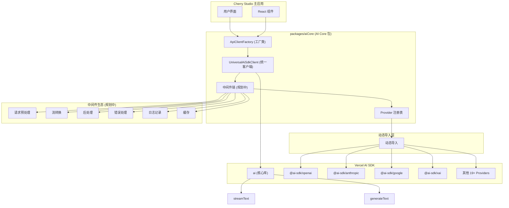

# Cherry Studio AI Core 基于 Vercel AI SDK 的技术架构

## 1. 架构设计理念

### 1.1 设计目标
- **统一接口**：使用 Vercel AI SDK 统一不同 AI Provider 的接口差异
- **动态导入**：通过动态导入实现按需加载，减少打包体积
- **最小包装**：直接使用 AI SDK 的类型和接口，避免重复定义
- **中间件增强**：扩大中间件的介入范围，覆盖请求的全生命周期（规划中）
- **类型安全**：利用 TypeScript 和 AI SDK 的类型系统确保类型安全
- **轻量级**：专注核心功能，保持包的轻量和高效
- **包级独立**：作为独立包管理，便于复用和维护

### 1.2 核心优势
- **标准化**：AI SDK 提供统一的模型接口，减少适配工作
- **简化维护**：废弃复杂的 XxxApiClient，统一为工厂函数模式
- **更好的开发体验**：完整的 TypeScript 支持和丰富的生态系统
- **性能优化**：AI SDK 内置优化和最佳实践
- **模块化设计**：独立包结构，支持跨项目复用
- **可扩展中间件**：支持在请求全生命周期中插入自定义逻辑

## 2. 整体架构图



## 3. 包结构设计

### 3.1 包级文件结构（当前简化版 + 规划）

```
packages/aiCore/
├── src/
│   ├── providers/
│   │   ├── registry.ts              # Provider 注册表 ✅
│   │   └── types.ts                 # 核心类型定义 ✅
│   ├── clients/
│   │   ├── UniversalAiSdkClient.ts  # 统一AI SDK客户端 ✅
│   │   └── ApiClientFactory.ts     # 客户端工厂 ✅
│   ├── middleware/                  # 中间件系统 (规划中)
│   │   ├── lifecycle/               # 生命周期中间件
│   │   │   ├── PreRequestMiddleware.ts
│   │   │   ├── PostResponseMiddleware.ts
│   │   │   ├── ErrorHandlingMiddleware.ts
│   │   │   └── CacheMiddleware.ts
│   │   ├── core/                    # 核心中间件
│   │   │   ├── StreamProcessingMiddleware.ts
│   │   │   ├── RequestValidationMiddleware.ts
│   │   │   └── ResponseTransformMiddleware.ts
│   │   ├── feat/                    # 特性中间件
│   │   │   ├── ThinkingMiddleware.ts
│   │   │   ├── ToolCallMiddleware.ts
│   │   │   └── WebSearchMiddleware.ts
│   │   ├── builder.ts               # 中间件构建器
│   │   ├── composer.ts              # 中间件组合器
│   │   ├── register.ts              # 中间件注册表
│   │   └── types.ts                 # 中间件类型定义
│   ├── services/                    # 高级服务 (规划中)
│   │   ├── AiCoreService.ts         # 统一服务入口
│   │   ├── CompletionsService.ts    # 文本生成服务
│   │   ├── EmbeddingService.ts      # 嵌入服务
│   │   └── ImageService.ts          # 图像生成服务
│   └── index.ts                     # 包主入口文件 ✅
├── package.json                     # 包配置文件 ✅
├── tsconfig.json                    # TypeScript 配置 ✅
├── README.md                        # 包说明文档 ✅
└── AI_SDK_ARCHITECTURE.md           # 本文档 ✅
```

**图例：**
- ✅ 已实现
- 规划中：设计完成，待实现

### 3.2 包配置 (package.json)

```json
{
  "name": "@cherry-studio/ai-core",
  "version": "1.0.0",
  "description": "Cherry Studio AI Core - 基于 Vercel AI SDK 的统一 AI Provider 接口",
  "main": "dist/index.js",
  "types": "dist/index.d.ts",
  "dependencies": {
    "ai": "^4.3.16"
  },
  "peerDependenciesMeta": {
    "@ai-sdk/openai": { "optional": true },
    "@ai-sdk/anthropic": { "optional": true },
    "@ai-sdk/google": { "optional": true },
    "@ai-sdk/xai": { "optional": true }
  },
  "keywords": [
    "ai", "sdk", "vercel-ai-sdk", "cherry-studio"
  ]
}
```

## 4. 核心组件详解

### 4.1 Provider 注册表 (`providers/registry.ts`)

统一管理所有 AI Provider 的注册和动态导入。

**主要功能：**
- 动态导入 AI SDK providers
- 提供统一的 Provider 创建接口
- 支持 19+ 官方 AI SDK providers
- 类型安全的 Provider 配置

**核心 API：**
```typescript
export interface ProviderConfig {
  id: string
  name: string
  import: () => Promise<any>
  creatorFunctionName: string
}

export class AiProviderRegistry {
  getProvider(id: string): ProviderConfig | undefined
  getAllProviders(): ProviderConfig[]
  isSupported(id: string): boolean
  registerProvider(config: ProviderConfig): void
}
```

**支持的 Providers：**
- OpenAI, Anthropic, Google, XAI
- Azure OpenAI, Amazon Bedrock, Google Vertex
- Groq, Together.ai, Fireworks, DeepSeek
- Cerebras, DeepInfra, Replicate, Perplexity
- Cohere, Fal AI, Vercel (19+ providers)

### 4.2 统一AI SDK客户端 (`clients/UniversalAiSdkClient.ts`)

将不同 AI providers 包装为统一接口。

**主要功能：**
- 异步初始化和动态加载
- 统一的 stream() 和 generate() 方法
- 直接使用 AI SDK 的 streamText() 和 generateText()
- 配置验证和错误处理

**核心 API：**
```typescript
export class UniversalAiSdkClient {
  async initialize(): Promise<void>
  isInitialized(): boolean
  async stream(request: any): Promise<any>
  async generate(request: any): Promise<any>
  validateConfig(): boolean
  getProviderInfo(): { id: string; name: string; isInitialized: boolean }
}
```

### 4.3 客户端工厂 (`clients/ApiClientFactory.ts`)

统一创建和管理 AI SDK 客户端。

**主要功能：**
- 统一的客户端创建接口
- 智能缓存和复用机制
- 批量创建和健康检查
- 错误处理和重试

**核心 API：**
```typescript
export class ApiClientFactory {
  static async createAiSdkClient(providerId: string, options: any): Promise<UniversalAiSdkClient>
  static getCachedClient(providerId: string, options: any): UniversalAiSdkClient | undefined
  static clearCache(): void
  static async healthCheck(): Promise<HealthCheckResult>
  static getSupportedProviders(): ProviderInfo[]
}
```

### 4.4 增强的中间件系统 (规划中)

扩展中间件架构，支持请求全生命周期的介入。

**生命周期阶段：**
1. **Pre-Request**：请求预处理、参数验证、缓存检查
2. **Request**：实际的 AI SDK 调用
3. **Stream Processing**：流式响应处理、实时转换
4. **Post-Response**：响应后处理、结果聚合
5. **Error Handling**：错误处理、重试、降级

**中间件分类：**

**生命周期中间件：**
- `PreRequestMiddleware`：请求前处理，参数验证、权限检查
- `PostResponseMiddleware`：响应后处理，结果转换、统计记录
- `ErrorHandlingMiddleware`：错误处理，重试机制、降级策略
- `CacheMiddleware`：缓存中间件，请求缓存、结果缓存

**核心中间件：**
- `StreamProcessingMiddleware`：流式处理，chunk 转换、进度追踪
- `RequestValidationMiddleware`：请求验证，schema 验证、安全检查
- `ResponseTransformMiddleware`：响应转换，格式标准化、类型转换

**特性中间件：**
- `ThinkingMiddleware`：思考过程中间件，记录推理步骤
- `ToolCallMiddleware`：工具调用中间件，函数调用处理
- `WebSearchMiddleware`：网络搜索中间件，集成搜索功能

**中间件 API 设计：**
```typescript
export interface Middleware {
  name: string
  priority: number
  execute(context: MiddlewareContext, next: () => Promise<void>): Promise<void>
}

export interface MiddlewareContext {
  request: AiCoreRequest
  response?: AiCoreResponse
  error?: Error
  metadata: Record<string, any>
  provider: string
  model: string
}

export class MiddlewareChain {
  use(middleware: Middleware): this
  compose(): (context: MiddlewareContext) => Promise<void>
  execute(context: MiddlewareContext): Promise<void>
}
```

### 4.5 统一服务接口 (规划中)

作为包的主要对外接口，提供高级 AI 功能。

**服务方法：**
- `completions()`: 文本生成
- `streamCompletions()`: 流式文本生成
- `generateObject()`: 结构化数据生成
- `generateImage()`: 图像生成
- `embed()`: 文本嵌入

**API 设计：**
```typescript
export class AiCoreService {
  constructor(middlewares?: Middleware[])
  
  async completions(request: CompletionRequest): Promise<CompletionResponse>
  async streamCompletions(request: CompletionRequest): Promise<StreamCompletionResponse>
  async generateObject<T>(request: ObjectGenerationRequest): Promise<T>
  async generateImage(request: ImageGenerationRequest): Promise<ImageResponse>
  async embed(request: EmbeddingRequest): Promise<EmbeddingResponse>
  
  use(middleware: Middleware): this
  configure(config: AiCoreConfig): this
}
```

## 5. 使用方式

### 5.1 基础用法

```typescript
import { createAiSdkClient } from '@cherry-studio/ai-core'

// 创建 OpenAI 客户端
const client = await createAiSdkClient('openai', {
  apiKey: 'your-api-key'
})

// 流式生成
const result = await client.stream({
  modelId: 'gpt-4',
  messages: [{ role: 'user', content: 'Hello!' }]
})

// 非流式生成
const response = await client.generate({
  modelId: 'gpt-4',
  messages: [{ role: 'user', content: 'Hello!' }]
})
```

### 5.2 便捷函数

```typescript
import { createOpenAIClient, streamGeneration } from '@cherry-studio/ai-core'

// 快速创建特定 provider 客户端
const client = await createOpenAIClient({
  apiKey: 'your-api-key'
})

// 便捷的一次性调用
const result = await streamGeneration(
  'anthropic',
  'claude-3-sonnet',
  [{ role: 'user', content: 'Hello!' }],
  { apiKey: 'your-api-key' }
)
```

### 5.3 多 Provider 支持

```typescript
import { createAiSdkClient, AiCore } from '@cherry-studio/ai-core'

// 检查支持的 providers
const providers = AiCore.getSupportedProviders()
console.log(`支持 ${providers.length} 个 AI providers`)

// 创建多个 provider 客户端
const openai = await createAiSdkClient('openai', { apiKey: 'openai-key' })
const anthropic = await createAiSdkClient('anthropic', { apiKey: 'anthropic-key' })
const google = await createAiSdkClient('google', { apiKey: 'google-key' })
const xai = await createAiSdkClient('xai', { apiKey: 'xai-key' })
```

### 5.4 在 Cherry Studio 中集成

```typescript
// 替换现有的 XxxApiClient
// 之前：
// const openaiClient = new OpenAIApiClient(config)
// const anthropicClient = new AnthropicApiClient(config)

// 现在：
import { createAiSdkClient } from '@cherry-studio/ai-core'

const createProviderClient = async (provider: CherryProvider) => {
  return await createAiSdkClient(provider.id, {
    apiKey: provider.apiKey,
    baseURL: provider.baseURL
  })
}
```

### 5.5 中间件使用 (规划中)

```typescript
import { 
  AiCoreService, 
  ThinkingMiddleware, 
  CacheMiddleware,
  LoggingMiddleware 
} from '@cherry-studio/ai-core'

// 创建带中间件的服务
const aiService = new AiCoreService()
  .use(new CacheMiddleware({ ttl: 3600 }))
  .use(new LoggingMiddleware({ level: 'info' }))
  .use(new ThinkingMiddleware({ recordSteps: true }))

// 使用增强的服务
const result = await aiService.streamCompletions({
  provider: 'openai',
  model: 'gpt-4',
  messages: [{ role: 'user', content: 'Explain quantum computing' }],
  middleware: {
    thinking: { enabled: true },
    cache: { enabled: true, key: 'quantum-explanation' }
  }
})

// 自定义中间件
class CustomMiddleware implements Middleware {
  name = 'custom'
  priority = 100

  async execute(context: MiddlewareContext, next: () => Promise<void>): Promise<void> {
    console.log('Before request:', context.request)
    
    await next() // 执行下一个中间件或实际请求
    
    console.log('After response:', context.response)
  }
}

aiService.use(new CustomMiddleware())
```

### 5.6 完整的工作流示例 (规划中)

```typescript
import { 
  createAiSdkClient,
  AiCoreService,
  MiddlewareChain,
  PreRequestMiddleware,
  StreamProcessingMiddleware,
  PostResponseMiddleware
} from '@cherry-studio/ai-core'

// 创建完整的工作流
const createEnhancedAiService = async () => {
  // 创建中间件链
  const middlewareChain = new MiddlewareChain()
    .use(new PreRequestMiddleware({
      validateApiKey: true,
      checkRateLimit: true
    }))
    .use(new StreamProcessingMiddleware({
      enableProgressTracking: true,
      chunkTransform: (chunk) => ({
        ...chunk,
        timestamp: Date.now()
      })
    }))
    .use(new PostResponseMiddleware({
      saveToHistory: true,
      calculateMetrics: true
    }))

  // 创建服务实例
  const service = new AiCoreService(middlewareChain.middlewares)

  return service
}

// 使用增强服务
const enhancedService = await createEnhancedAiService()

const response = await enhancedService.completions({
  provider: 'anthropic',
  model: 'claude-3-sonnet',
  messages: [
    { role: 'user', content: 'Write a technical blog post about AI middleware' }
  ],
  options: {
    temperature: 0.7,
    maxTokens: 2000
  },
  middleware: {
    // 中间件特定配置
    thinking: { recordSteps: true },
    cache: { enabled: true, ttl: 1800 },
    logging: { level: 'debug' }
  }
})
```

## 6. 与现有架构的对比

| 方面 | 现有架构 | 新架构 (AI Core 包) |
|------|----------|-------------------|
| **代码组织** | 集成在主应用中 | 独立包，模块化管理 |
| **Provider 管理** | 各自独立的 XxxApiClient | 统一的 Provider 注册表 + 工厂 |
| **接口标准化** | 手动适配各 Provider 差异 | AI SDK 统一接口 |
| **类型安全** | 部分类型安全 | 完整的 TypeScript 支持 |
| **维护成本** | 每个 Provider 需要单独维护 | 统一维护，新 Provider 快速接入 |
| **包体积** | 所有 Provider 都打包 | 按需加载，动态导入 |
| **复用性** | 仅限当前项目 | 可跨项目复用 |
| **扩展性** | 添加新 Provider 复杂 | 只需在注册表中添加配置 |

## 7. 简化设计原则

### 7.1 最小包装原则
- 直接使用 AI SDK 的类型，不重复定义
- 避免过度抽象和复杂的中间层
- 保持与 AI SDK 原生 API 的一致性

### 7.2 动态导入优化
```typescript
// 按需加载，减少打包体积
const module = await import('@ai-sdk/openai')
const createOpenAI = module.createOpenAI
```

### 7.3 类型安全
```typescript
// 直接使用 AI SDK 类型
import { streamText, generateText } from 'ai'

// 避免重复定义，直接传递参数
return streamText({ model, ...request })
```

### 7.4 配置简化
```typescript
// 简化的 Provider 配置
interface ProviderConfig {
  id: string                          // provider 标识
  name: string                        // 显示名称  
  import: () => Promise<any>          // 动态导入函数
  creatorFunctionName: string         // 创建函数名
}
```

## 8. 技术要点

### 8.1 动态导入策略
- **按需加载**：只加载用户实际使用的 providers
- **缓存机制**：避免重复导入和初始化
- **错误处理**：优雅处理导入失败的情况

### 8.2 依赖管理策略
- **核心依赖**：`ai` 库作为必需依赖
- **可选依赖**：所有 `@ai-sdk/*` 包都是可选的
- **版本兼容**：支持 AI SDK v3-v5 版本

### 8.3 缓存策略
- **客户端缓存**：基于 provider + options 的智能缓存
- **配置哈希**：安全的 API key 哈希处理
- **生命周期管理**：支持缓存清理和验证

## 9. 迁移策略

### 9.1 阶段一：包基础搭建 (Week 1) ✅ 已完成
1. ✅ 创建简化的包结构
2. ✅ 实现 Provider 注册表
3. ✅ 创建统一客户端和工厂
4. ✅ 配置构建和类型系统

### 9.2 阶段二：核心功能完善 (Week 2) ✅ 已完成
1. ✅ 支持 19+ 官方 AI SDK providers
2. ✅ 实现缓存和错误处理
3. ✅ 完善类型安全和 API 设计
4. ✅ 添加便捷函数和工具

### 9.3 阶段三：集成测试 (Week 3) 🔄 进行中
1. 在 Cherry Studio 中集成测试
2. 功能完整性验证
3. 性能基准测试
4. 兼容性问题修复

### 9.4 阶段四：中间件系统实现 (Week 4-5) 📋 规划中
1. **中间件核心架构**
   - 实现 `MiddlewareChain` 和 `MiddlewareContext`
   - 创建中间件接口和基础类型
   - 建立中间件生命周期管理

2. **生命周期中间件**
   - `PreRequestMiddleware`：请求预处理
   - `PostResponseMiddleware`：响应后处理
   - `ErrorHandlingMiddleware`：错误处理
   - `CacheMiddleware`：缓存机制

3. **核心中间件**
   - `StreamProcessingMiddleware`：流式处理
   - `RequestValidationMiddleware`：请求验证
   - `ResponseTransformMiddleware`：响应转换

4. **集成到现有架构**
   - 在 `UniversalAiSdkClient` 中集成中间件链
   - 更新 `ApiClientFactory` 支持中间件配置
   - 创建 `AiCoreService` 统一服务接口

### 9.5 阶段五：特性中间件 (Week 6) 📋 规划中
1. **Cherry Studio 特性中间件**
   - `ThinkingMiddleware`：思考过程记录
   - `ToolCallMiddleware`：工具调用处理
   - `WebSearchMiddleware`：网络搜索集成

2. **高级功能**
   - 中间件组合器和构建器
   - 动态中间件加载
   - 中间件配置管理

### 9.6 阶段六：文档和发布 (Week 7) 📋 规划中
1. 完善使用文档和示例
2. 中间件开发指南
3. 准备发布到 npm
4. 建立维护流程

### 9.7 阶段七：生态系统扩展 (Week 8+) 🚀 未来规划
1. 社区中间件插件系统
2. 可视化中间件编排工具
3. 性能监控和分析
4. 高级缓存策略

## 10. 预期收益

### 10.1 开发效率提升
- **90%** 减少新 Provider 接入时间（只需添加注册表配置）
- **70%** 减少维护工作量
- **95%** 提升开发体验（统一接口 + 类型安全）
- **独立开发**：可以独立于主应用开发和测试

### 10.2 代码质量改善
- 完整的 TypeScript 类型安全
- 统一的错误处理机制
- 标准化的 AI SDK 接口
- 更好的测试覆盖率

### 10.3 架构优势
- **轻量级**：最小化的包装层
- **可复用**：其他项目可以直接使用
- **可维护**：独立版本管理和发布
- **可扩展**：新 provider 只需配置即可

### 10.4 生态系统价值
- 支持 AI SDK 的完整生态系统
- 可以独立发布到 npm
- 为开源社区贡献价值
- 建立统一的 AI 基础设施

## 11. 风险评估与应对

### 11.1 技术风险
- **AI SDK 版本兼容**：支持多版本兼容策略
- **依赖管理**：合理使用 peerDependencies
- **类型一致性**：直接使用 AI SDK 类型
- **性能影响**：最小化包装层开销

### 11.2 迁移风险
- **功能对等性**：确保所有现有功能都能实现
- **API 兼容性**：提供平滑的迁移路径
- **集成复杂度**：保持简单的集成方式
- **学习成本**：提供清晰的使用文档

## 12. 总结

简化的 AI Core 架构专注于核心价值：

### 12.1 核心价值
- **统一接口**：一套 API 支持 19+ AI providers
- **按需加载**：只打包用户实际使用的 providers
- **类型安全**：完整的 TypeScript 支持
- **轻量高效**：最小化的包装层

### 12.2 设计哲学
- **直接使用 AI SDK**：避免重复造轮子
- **最小包装**：只在必要时添加抽象层
- **开发者友好**：简单易用的 API 设计
- **生态兼容**：充分利用 AI SDK 生态系统

### 12.3 成功关键
1. **保持简单**：专注核心功能，避免过度设计
2. **充分测试**：确保功能完整性和稳定性
3. **渐进迁移**：平滑过渡，降低风险
4. **文档完善**：支持快速上手和深度使用

这个简化的架构为 Cherry Studio 提供了一个轻量、高效、可维护的 AI 基础设施，同时为社区贡献了一个高质量的开源包。 