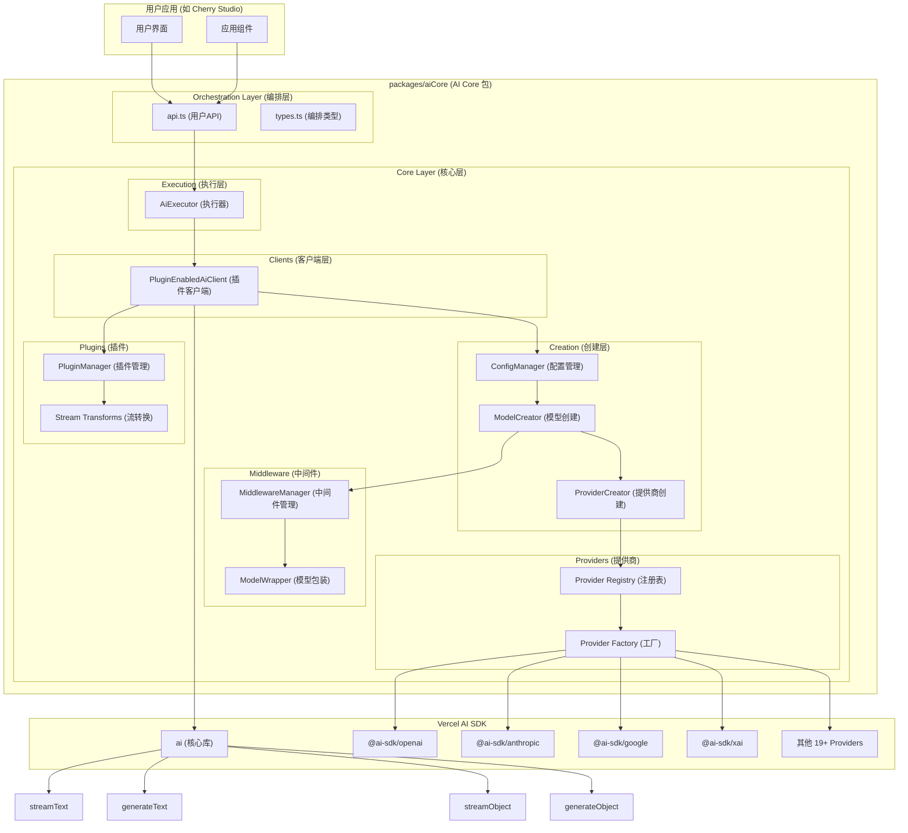

# AI Core 基于 Vercel AI SDK 的技术架构

## 1. 架构设计理念

### 1.1 设计目标

- **分层架构**：orchestration（编排层）→ core（核心层），职责分离
- **统一接口**：使用 Vercel AI SDK 统一不同 AI Provider 的接口差异
- **动态导入**：通过动态导入实现按需加载，减少打包体积
- **最小包装**：直接使用 AI SDK 的类型和接口，避免重复定义
- **插件系统**：基于钩子的通用插件架构，支持请求全生命周期扩展
- **类型安全**：利用 TypeScript 和 AI SDK 的类型系统确保类型安全
- **轻量级**：专注核心功能，保持包的轻量和高效
- **包级独立**：作为独立包管理，便于复用和维护

### 1.2 核心优势

- **标准化**：AI SDK 提供统一的模型接口，减少适配工作
- **分层设计**：清晰的职责分离，便于维护和扩展
- **更好的开发体验**：完整的 TypeScript 支持和丰富的生态系统
- **性能优化**：AI SDK 内置优化和最佳实践
- **模块化设计**：独立包结构，支持跨项目复用
- **可扩展插件**：通用的流转换和参数处理插件系统

## 2. 整体架构图



## 3. 包结构设计

### 3.1 当前架构文件结构

```
packages/aiCore/
├── src/
│   ├── orchestration/               # 编排层 - 用户面向接口
│   │   ├── api.ts                   # 主要API函数 ✅
│   │   ├── types.ts                 # 编排类型定义 ✅
│   │   └── index.ts                 # 编排层导出 ✅
│   ├── core/                        # 核心层 - 内部实现
│   │   ├── creation/                # 创建层
│   │   │   ├── types.ts             # 创建类型定义 ✅
│   │   │   ├── ConfigManager.ts     # 配置管理器 ✅
│   │   │   ├── ModelCreator.ts      # 模型创建器 ✅
│   │   │   ├── ProviderCreator.ts   # 提供商创建器 ✅
│   │   │   └── index.ts             # 创建层导出 ✅
│   │   ├── execution/               # 执行层
│   │   │   ├── types.ts             # 执行类型定义 ✅
│   │   │   ├── AiExecutor.ts        # AI执行器 ✅
│   │   │   └── index.ts             # 执行层导出 ✅
│   │   ├── clients/                 # 客户端层
│   │   │   ├── PluginEnabledAiClient.ts # 插件客户端 ✅
│   │   │   └── index.ts             # 客户端导出 ✅
│   │   ├── middleware/              # 中间件系统
│   │   │   ├── types.ts             # 中间件类型 ✅
│   │   │   ├── MiddlewareManager.ts # 中间件管理器 ✅
│   │   │   ├── ModelWrapper.ts      # 模型包装器 ✅
│   │   │   └── index.ts             # 中间件导出 ✅
│   │   ├── plugins/                 # 插件系统
│   │   │   ├── types.ts             # 插件类型定义 ✅
│   │   │   ├── manager.ts           # 插件管理器 ✅
│   │   │   ├── examples/            # 示例插件 ✅
│   │   │   │   ├── example-plugins.ts
│   │   │   │   └── example-usage.ts
│   │   │   ├── README.md            # 插件文档 ✅
│   │   │   └── index.ts             # 插件导出 ✅
│   │   ├── providers/               # 提供商管理
│   │   │   ├── registry.ts          # 提供商注册表 ✅
│   │   │   ├── factory.ts           # 提供商工厂 ✅
│   │   │   ├── types.ts             # 提供商类型 ✅
│   │   │   └── utils.ts             # 工具函数 ✅
│   │   └── index.ts                 # 核心层导出 ✅
│   ├── types.ts                     # 全局类型定义 ✅
│   └── index.ts                     # 包主入口文件 ✅
├── package.json                     # 包配置文件 ✅
├── tsconfig.json                    # TypeScript 配置 ✅
├── README.md                        # 包说明文档 ✅
└── AI_SDK_ARCHITECTURE.md           # 本文档 ✅
```

## 4. 架构分层详解

### 4.1 Orchestration Layer (编排层)

**职责**：面向用户的主要API接口，提供简洁的使用体验

**核心文件**：

- `api.ts`: 主要API函数 (`streamText`, `generateText`, `streamObject`, `generateObject`)
- `types.ts`: 编排配置类型定义

**设计特点**：

- 支持两种使用方式：配置模式和直接AI SDK模式
- 统一的函数重载设计
- 自动处理执行器创建和调用

**核心API**：

```typescript
// 配置模式 - 推荐使用
export async function streamText<T extends ProviderId>(
  config: OrchestrationConfig<T>,
  modelId: string,
  params: StreamTextParams
): Promise<ReturnType<typeof aiStreamText>>

// 直接AI SDK模式 - 兼容原生使用
export async function streamText(params: Parameters<typeof aiStreamText>[0]): Promise<ReturnType<typeof aiStreamText>>
```

### 4.2 Core Layer (核心层)

#### 4.2.1 Creation Layer (创建层)

**职责**：负责配置解析、模型创建和提供商管理

**核心组件**：

- `ConfigManager`: 配置解析和中间件收集
- `ModelCreator`: 高级模型创建逻辑
- `ProviderCreator`: 底层提供商导入和模型创建

**关键功能**：

```typescript
// 配置管理
export function resolveConfig(
  providerId: ProviderId,
  modelId: string,
  userOptions: ProviderSettingsMap[ProviderId],
  plugins: AiPlugin[] = []
): ResolvedConfig

// 模型创建
export async function createModel(
  providerId: ProviderId,
  modelId: string,
  userOptions: ProviderSettingsMap[ProviderId],
  plugins: AiPlugin[] = []
): Promise<LanguageModel>
```

#### 4.2.2 Execution Layer (执行层)

**职责**：AI执行引擎，封装插件处理逻辑

**核心组件**：

- `AiExecutor`: 主要执行器类

**设计特点**：

- 构造时确定插件配置，运行时不可变更
- 内部使用 `PluginEnabledAiClient` 处理插件
- 提供类型安全的API接口

**核心API**：

```typescript
export class AiExecutor<T extends ProviderId = any> {
  static create<T extends ProviderId>(
    providerId: T,
    options: ProviderSettingsMap[T],
    plugins: AiPlugin[] = []
  ): AiExecutor<T>

  async streamText(modelId: string, params: StreamTextParams): Promise<StreamTextResult<any>>
  async generateText(modelId: string, params: GenerateTextParams): Promise<GenerateTextResult<any>>
  async streamObject(modelId: string, params: StreamObjectParams): Promise<StreamObjectResult<any>>
  async generateObject(modelId: string, params: GenerateObjectParams): Promise<GenerateObjectResult<any>>
}
```

#### 4.2.3 Clients Layer (客户端层)

**职责**：插件处理，连接插件系统和AI SDK

**核心组件**：

- `PluginEnabledAiClient`: 处理插件执行和AI SDK调用

**设计特点**：

- 使用 core/creation 层创建模型
- 区分 streaming 和 non-streaming 插件处理
- 支持 `streamText` 的流转换和其他方法的常规插件处理

#### 4.2.4 Middleware Layer (中间件层)

**职责**：AI SDK原生中间件支持

**核心组件**：

- `MiddlewareManager`: 中间件管理 (函数式)
- `ModelWrapper`: 模型包装器 (函数式)

**设计哲学**：

- 使用函数而非类，简化设计
- 直接使用AI SDK的 `wrapLanguageModel`
- 与插件系统分离，职责明确

#### 4.2.5 Plugins Layer (插件层)

**职责**：特定的插件功能

**核心组件**：

- `PluginManager`: 插件管理器
- 流转换收集：`collectStreamTransforms`

**设计特点**：

- 支持流转换 (`experimental_transform`)
- 与AI SDK中间件分离
- 专注于特定需求

#### 4.2.6 Providers Layer (提供商层)

**职责**：AI Provider注册表和动态导入

**核心组件**：

- `registry.ts`: 19+ Provider配置和类型
- `factory.ts`: Provider配置工厂

**支持的Providers**：

- OpenAI, Anthropic, Google, XAI
- Azure OpenAI, Amazon Bedrock, Google Vertex
- Groq, Together.ai, Fireworks, DeepSeek
- 等19+ AI SDK官方支持的providers

## 5. 使用方式

### 5.1 推荐使用方式 (Orchestration API)

```typescript
import { streamText, generateText } from '@cherrystudio/ai-core'

// 配置模式使用
const config = {
  providerId: 'openai',
  options: { apiKey: 'your-api-key' },
  plugins: [thinkingPlugin, toolPlugin]
}

// 流式文本生成
const stream = await streamText(config, 'gpt-4', {
  messages: [{ role: 'user', content: 'Hello!' }]
})

// 普通文本生成
const result = await generateText(config, 'gpt-4', {
  messages: [{ role: 'user', content: 'Hello!' }]
})
```

### 5.2 直接AI SDK模式 (兼容性)

```typescript
import { streamText } from '@cherrystudio/ai-core'
import { openai } from '@ai-sdk/openai'

// 直接使用AI SDK模式
const stream = await streamText({
  model: openai('gpt-4'),
  messages: [{ role: 'user', content: 'Hello!' }]
})
```

### 5.3 执行器模式 (高级用法)

```typescript
import { AiExecutor } from '@cherrystudio/ai-core'

// 创建执行器
const executor = AiExecutor.create('openai', { apiKey: 'your-api-key' }, [plugin1, plugin2])

// 使用执行器
const stream = await executor.streamText('gpt-4', {
  messages: [{ role: 'user', content: 'Hello!' }]
})
```

## 6. 插件系统详解

### 6.1 插件接口设计

```typescript
export interface AiPlugin {
  name: string
  collectStreamTransforms?: (context: AiRequestContext) => StreamTransform[]
  transformParams?: (params: any, context: AiRequestContext) => Promise<any>
  transformResult?: (result: any, context: AiRequestContext) => Promise<any>
  onRequest?: (context: AiRequestContext) => Promise<void>
  onSuccess?: (result: any, context: AiRequestContext) => Promise<void>
  onError?: (error: Error, context: AiRequestContext) => Promise<void>
}
```

### 6.2 流转换支持

专门针对 `streamText` 的流转换功能：

```typescript
// 插件收集流转换
const streamTransforms = pluginManager.collectStreamTransforms(context)

// 应用到AI SDK
const result = await streamText({
  model,
  ...params,
  experimental_transform: streamTransforms.length > 0 ? composeTransforms(streamTransforms) : undefined
})
```

### 6.3 插件vs中间件

| 功能     | 插件 (Plugins)                   | 中间件 (Middleware) |
| -------- | -------------------------------- | ------------------- |
| 用途     | 应用特定功能                     | AI SDK原生功能      |
| 流转换   | ✅ 支持 `experimental_transform` | ❌ 不支持           |
| 适用范围 | 所有AI方法                       | 所有AI方法          |
| 应用时机 | 运行时                           | 创建时              |
| 复杂度   | 简单                             | 原生AI SDK          |

## 7. 架构优势

### 7.1 分层清晰

- **Orchestration**: 用户友好的API
- **Core**: 模块化的内部实现
- **职责分离**: 每层专注自己的职责

### 7.2 函数式设计

- 大部分模块使用函数而非类
- 更简洁的代码和更好的可测试性
- 避免不必要的面向对象复杂性

### 7.3 类型安全

- 统一使用 `types.ts` 中的类型定义
- 避免重复定义，提高维护性
- 完整的 TypeScript 支持

### 7.4 灵活扩展

- 插件系统支持流转换
- 中间件系统支持AI SDK原生功能
- 模块化设计便于功能扩展

## 8. 迁移状态

### 8.1 已完成 ✅

1. **架构重构** - 分层设计和职责分离
2. **类型系统** - 统一类型定义和复用
3. **函数式设计** - 从类转换为函数
4. **插件系统** - 流转换和通用插件功能
5. **Orchestration层** - 用户友好的API接口
6. **Core层完整实现** - 创建、执行、客户端、中间件、插件、提供商

### 8.2 进行中 🔄

1. **集成测试** - 在实际项目中完整测试
2. **性能优化** - 确保无性能退化
3. **文档完善** - 使用指南和最佳实践

### 8.3 计划中 📋

1. **生态系统扩展** - 更多通用插件
2. **优化改进** - 基于使用反馈的持续改进
3. **社区贡献** - 开源发布和社区生态

## 9. 技术决策记录

### 9.1 为什么选择分层架构？

- **用户体验**: Orchestration层提供简洁API
- **内部复杂性**: Core层处理复杂逻辑
- **维护性**: 清晰的职责分离

### 9.2 为什么选择函数式设计？

- **简洁性**: 避免不必要的类设计
- **可测试性**: 函数更容易测试
- **性能**: 减少对象创建开销

### 9.3 为什么分离插件和中间件？

- **职责明确**: 插件处理应用特定需求
- **原生支持**: 中间件使用AI SDK原生功能
- **灵活性**: 两套系统可以独立演进

## 10. 总结

新的AI Core架构实现了：

### 10.1 设计目标

- ✅ **分层架构**: 清晰的编排层和核心层分离
- ✅ **函数式设计**: 简洁的函数式API
- ✅ **类型安全**: 统一的类型定义和复用
- ✅ **插件扩展**: 支持流转换的插件系统
- ✅ **易用性**: 多种使用模式满足不同需求

### 10.2 核心价值

- **统一接口**: 一套API支持19+ AI providers
- **灵活使用**: 配置模式、AI SDK模式、执行器模式
- **强类型**: 完整的TypeScript支持
- **可扩展**: 插件和中间件双重扩展能力
- **高性能**: 最小化包装，直接使用AI SDK

### 10.3 未来发展

这个架构提供了坚实的AI基础设施，支持：

- 持续的功能扩展
- 良好的开发体验
- 社区生态建设
- 跨项目复用价值
